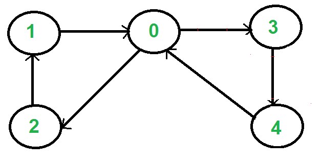
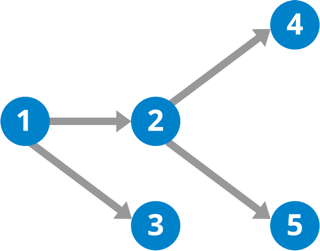

# GRAPH

## What is graph?

A graph data structure is a way of representing the relationships and connections between a set of entities. It consists of two main components: nodes (or vertices) and edges. Each node represents an entity, and each edge represents a connection or relationship between two nodes. The edges may have a direction (directed graph) or may not (undirected graph), and they can be weighted to represent some measure of importance or cost.

## Directed Vs Undirected Graph

<h3>Directed Graph (Digraph):</h3>
- In a directed graph, each edge has a direction associated with it. The edges are ordered pairs, indicating a one-way connection from one node to another.
- Formally, an edge from node A to node B is distinct from an edge from B to A. The presence of an edge from A to B doesn't imply the existence of an edge from B to A.
- Directed graphs are useful for representing asymmetric relationships or flows where the direction matters, such as in network traffic, dependencies, or hierarchical structures.
 
 

 
 

<h3>Undirected Graph :</h3>
In an undirected graph, the edges have no direction. An edge between nodes A and B implies a connection in both directions—from A to B and from B to A.
 
 

## Cyclic Vs Acyclic

<h3>Cyclic</h3>
- A cyclic graph, on the other hand, contains at least one cycle.
- Cyclic graphs can represent scenarios where there are feedback loops or circular dependencies.
 
 

 
 

<h3>Uncyclic</h3>

- An acyclic graph, as the name suggests, does not contain any cycles.
- Acyclic graphs are also referred to as "DAGs" (Directed Acyclic Graphs) when dealing specifically with directed graphs.
   
   

## Weighted Vs Unweighted Graph

<h3>Weighted</h3>

- In a weighted graph, each edge has an associated numerical value known as a weight.
- These weights can represent various metrics, such as distances, costs, time, or any other relevant quantity associated with the relationship between the nodes connected by the edge.
  -Weighted graphs are used to model scenarios where the strength or cost of connections between nodes is quantifiable. For example, in a transportation network, the weights could represent distances between locations.
   
   

 
 

<h3>Uncyclic</h3>

- In an unweighted graph, all edges are considered to have equal value, and no numerical weights are associated with them.
   
   

