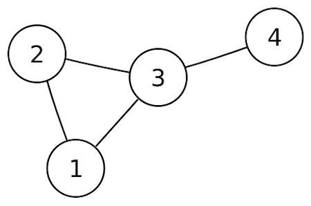
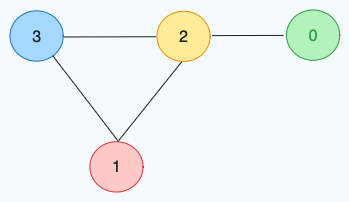

# GRAPH

## What is graph?

A graph data structure is a way of representing the relationships and connections between a set of entities. It consists of two main components: nodes (or vertices) and edges. Each node represents an entity, and each edge represents a connection or relationship between two nodes. The edges may have a direction (directed graph) or may not (undirected graph), and they can be weighted to represent some measure of importance or cost.

## Directed Vs Undirected Graph

<h3>Directed Graph (Digraph):</h3>
- In a directed graph, each edge has a direction associated with it. The edges are ordered pairs, indicating a one-way connection from one node to another.
- Formally, an edge from node A to node B is distinct from an edge from B to A. The presence of an edge from A to B doesn't imply the existence of an edge from B to A.
- Directed graphs are useful for representing asymmetric relationships or flows where the direction matters, such as in network traffic, dependencies, or hierarchical structures.
<br>
<br>


<br>
<br>

<h3>Undirected Graph :</h3>
In an undirected graph, the edges have no direction. An edge between nodes A and B implies a connection in both directions—from A to B and from B to A.
<br>
<br>



## Cyclic Vs Acyclic

<h3>Cyclic</h3>
- A cyclic graph, on the other hand, contains at least one cycle.
- Cyclic graphs can represent scenarios where there are feedback loops or circular dependencies.
<br>
<br>


<br>
<br>

<h3>Uncyclic</h3>

- An acyclic graph, as the name suggests, does not contain any cycles.
- Acyclic graphs are also referred to as "DAGs" (Directed Acyclic Graphs) when dealing specifically with directed graphs.
  <br>
  <br>


## Weighted Vs Unweighted Graph

<h3>Weighted</h3>

- In a weighted graph, each edge has an associated numerical value known as a weight.
- These weights can represent various metrics, such as distances, costs, time, or any other relevant quantity associated with the relationship between the nodes connected by the edge.
  -Weighted graphs are used to model scenarios where the strength or cost of connections between nodes is quantifiable. For example, in a transportation network, the weights could represent distances between locations.
  <br>
  <br>


<br>
<br>

<h3>Unweighted</h3>

- In an unweighted graph, all edges are considered to have equal value, and no numerical weights are associated with them.
  <br>
  <br>


---

## How to build a graph

there are three tradional way on how to create graph

- Edge List
- Adjacent List
- Adjacent Matrix

in this example we will use this graph as a case to understand each technique



# Edge List

with this technique the relationsips between the nodes are using list and nodes like the code bellow

```javascript
// example  Edge List with using list
const example1 = [
  [1, 2],
  [2, 3],
  [3, 1],
];

// example  Edge List with using touple
const example2 = [(1, 2), (2, 3), (3, 1)];
```

# Adjacent List

With adjacent list we going to use the index as the node and the value as the nodes neighbors.

```javascript
// but this technique wont work if there is the relationships is not numbers. what if data or word
const example1 = [[2], [2, 3], [0, 1, 3], [1, 2]];

// hence

// we use object instead with using the key as the node and the values as the neighbors99
const example2 = {
  0: [2],
  1: [2, 3],
  2: [0, 1, 3],
  3: [1, 2],
};
```

# Adjacent Matrix

with Adjacent Matrix we use the index and matrix as the relation of neighbor nodes

```javascript
// using list
const example1 = [
  [0, 0, 1, 0], // the relation of 0 and 2
  [0, 0, 1, 1], // the relation of 1, 2, 3,
  [1, 1, 0, 1], // the relation of 2, 0, 3
  [0, 1, 1, 0], // the relation of 3, 1, 2
];

// hence

// using object
const example1 = {
  0: [0, 0, 1, 0], // the relation of 0 and 2
  1: [0, 0, 1, 1], // the relation of 1, 2, 3,
  2: [1, 1, 0, 1], // the relation of 2, 0, 3
  3: [0, 1, 1, 0], // the relation of 3, 1, 2
};
```
