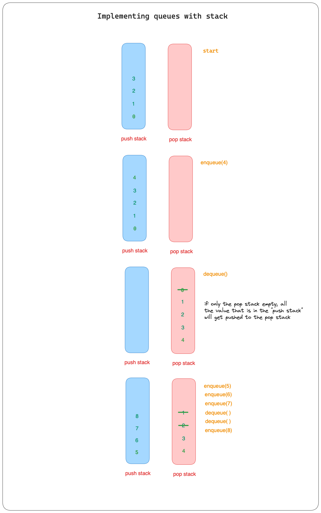

# QUEUES

A queue is a common data structure in computer science and programming that is used to store and manage a collection of elements. It follows the principle of `First In Firs Out (FIFO)`, which means that the first element added to the queue will be the first one to be removed.

FIFO : First In First Out

## Method

- `lookup()` O(n)
- `enqueue()` O(1)
- `denqueue()` O(1)
- `peek()` O(1)

## Arrays vs Linked list for Stack

<h3>ARRAY</h3>

Cons:<br>
You wouldnt want to build queue with array. Because arrays have indexes associated with them. Hence, when we dequeue, we need to loop over the array to fill the index 0. This operation will increate the time complexity into `O(n)` while we want the proces of dequeue is `O(1)`

---

<h3>LINKED LIST</h3>

Pro:<br>
When we create a queue, it is BEST using linklit since it dosent have index a associated with them. Instead they used a pointers which is `head` and `tail` . Also unshift a linklist is `O(1)` hence it suit the time complexity that is listed above.

---

# Implemeting Queue with Stacks



In queue that uses a stacts, we will use `two array` that will mimic an queue.

```javascript
  constructor() {
    this.popArr = [];
    this.pushArr = [];
    this.length = 0;
  }
```

### Enqueue

When we enqueue a value, it will always pushed to the pushAray

```javascript
  enqueue(element) {
    this.pushArr.push(element);
    this.length++;
    return this;
  }
```

### Dequeue

When dequeue method called it will do two different things with 2 different condition. The first condition is
when the popArr is empty and not empty.

popArr is empty<br>

1. The method will iterate all the value to the popArr array with using build in push and pop method.
2. Then it will erase the last value from the popArr array using pop() method

popArr is not empty<br>

1. It will erase the last value from the popArr array using pop() method

```javascript
 dequeue() {
    const length = this.pushArr.length;
    if (this.length === 0) {
      console.log("queue is empy");
      return null;
    }
    if (this.popArr.length === 0) {
      for (let i = 0; i < length; i++) {
        this.popArr.push(this.pushArr.pop());
      }
    }
    this.popArr.pop();
    this.length--;
    return this;
  }
```
