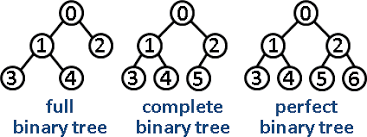

# BINARY TREE

A binary tree is a type of tree data structure in which each node has at most two children, which are referred to as the left child and the right child. The structure of a binary tree is such that each node can have zero, one, or two children. The nodes at the bottommost level of the tree, which do not have any children, are called leaf nodes.

## Type of binary tree

- Full Binary Tree: A binary tree in which each node has either 0 or 2 children. No node has only one child.
- Complete Binary Tree: A binary tree in which all levels are completely filled except possibly for the last level. In the last level, all nodes are as left as possible.
- Perfect Binary Tree: A binary tree in which all interior nodes have two children, and all leaf nodes are at the same level.
- Balanced Binary Tree: A binary tree in which the depth of the left and right subtrees of every node differs by no more than one.

## Most Common tree

- Binary Tree: Each node has at most two children, typically referred to as the left child and the right child.
- Binary Search Tree (BST): A binary tree with the property that the value of each node's left child is less than or equal to the node's value, and the value of each node's right child is greater than or equal to the node's value.
- N-ary Tree: A tree in which each node can have more than two children.
- Trie: A tree-like data structure used for storing an associative array where the keys are usually strings.
- Heap: A specialized tree-based data structure that satisfies the heap property, which depends on whether it is a min-heap or a max-heap.

## Method

- `lookup()` O(Log N)
- `Delete()` O(Log N)
- `Insert()` O(Log N)

## log(N) means ?

`h = heights`

nodes = 2^h-1 

- the equation above simply means that the ammount of nodes is equal 2 the power of the heights of the tree minus one<br<>

of nodes = 2^h -1 
log nodes = steps

- we get rid of the -1 because it is not significat. So basically when we said log(N) is means the maximum steps

`example:` 
the maximum steps for 7 nodes in binary stres are
log(7) = is 4 steps  
2^2.8 + 1 = 7
