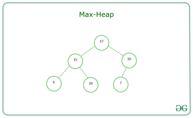

# BINARY TREE

A binary tree is a type of tree data structure in which each node has at most two children, which are referred to as the left child and the right child. The structure of a binary tree is such that each node can have zero, one, or two children. The nodes at the bottommost level of the tree, which do not have any children, are called leaf nodes.

## Type of binary tree

- Max Heap 
  

In a Max-Heap the key present at the root node must be greater than or equal among the keys present at all of its children. The same property must be recursively true for all sub-trees in that Binary Tree. In a Max-Heap the maximum key element present at the root. Below is the Binary Tree that satisfies all the property of Max Heap.

## Method

- `lookup()` O(Log N)
- `Delete()` O(Log N)
- `Insert()` O(Log N)
