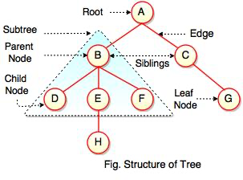

# TRIES

In programming, a tree is a hierarchical data structure that consists of nodes connected by edges. It is called a "tree" because it visually resembles an inverted tree with a root at the top and branches spreading downward. Each node in a tree has a parent node and zero or more child nodes.

## Key Concept

- Root: The topmost node in a tree, from which all other nodes are descended. It is the starting point for traversing the tree.
- Node: Each element or entity in a tree, which contains data and may have zero or more child nodes.
- Parent: A node in the tree that has one or more child nodes.
- Child: Nodes that are directly connected to another node, known as their parent.
- Leaf: Nodes that do not have any children; they are the terminal nodes at the bottom of the tree.
- Siblings: Nodes that share the same parent in a tree.
- Depth: The level or distance of a node from the root. The depth of the root node is typically 0.
- Height: The length of the longest path from a node to a leaf. The height of a tree is the height of its root node.
- Subtree: A tree formed by a node and all its descendants.

## Most Common tree

- Binary Tree: Each node has at most two children, typically referred to as the left child and the right child.
- Binary Search Tree (BST): A binary tree with the property that the value of each node's left child is less than or equal to the node's value, and the value of each node's right child is greater than or equal to the node's value.
- N-ary Tree: A tree in which each node can have more than two children.
- Trie: A tree-like data structure used for storing an associative array where the keys are usually strings.
- Heap: A specialized tree-based data structure that satisfies the heap property, which depends on whether it is a min-heap or a max-heap.
